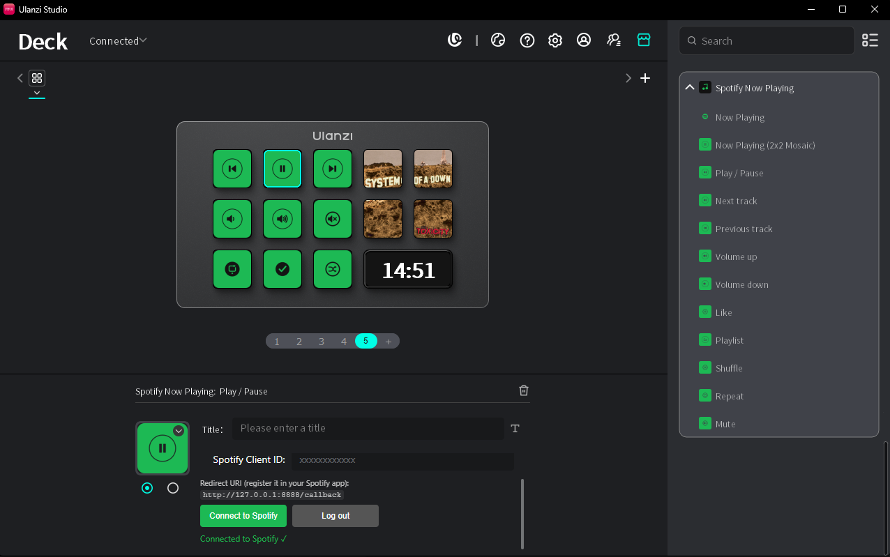

# Spotify Now Playing — Plugin para Ulanzi Stream Deck

[](README.md)
[](README.en.md)
[](README.es.md)

Plugin para el **Ulanzi Stream Deck (D200/D201)** que muestra la canción que suena en Spotify
(carátula + título), controla la reproducción, marca canciones como favoritas, alterna
aleatorio/repetición, lanza listas de reproducción y abre la aplicación — todo directamente
desde las teclas y el dial.

> Servicio principal en **Node.js v20**, integrado mediante la **Spotify Web API** con **OAuth
> Authorization Code + PKCE**. Los controles de reproducción requieren una cuenta **Premium**.



## Acciones

| Acción | Control | Descripción |
|--------|---------|-------------|
| **Now Playing** | Tecla | Carátula + título de la canción actual, con actualización automática. Sin música muestra el logo de Spotify; **al pulsar abre la aplicación** de Spotify en el PC. |
| **Now Playing (Mosaico 2×2)** | Tecla | Un cuadrante de la carátula. Cuatro teclas adyacentes en bloque 2×2 reconstruyen la imagen completa. Pulsar cualquiera abre Spotify. |
| **Reproducir / Pausar** | Tecla | Alterna entre reproducir y pausar. El icono refleja el estado (▶ en pausa, ⏸ reproduciendo). |
| **Siguiente pista** | Tecla | Salta a la siguiente. |
| **Pista anterior** | Tecla | Vuelve a la anterior (comportamiento estándar de Spotify: la 1.ª pulsación reinicia, la 2.ª retrocede). |
| **Volumen (dial)** | Encoder | Gira para ajustar el volumen; pulsa para silenciar/restaurar. |
| **Subir volumen** | Tecla | Sube el volumen un 10% (para el D200, que no tiene dial). |
| **Bajar volumen** | Tecla | Baja el volumen un 10%. |
| **Silenciar** | Tecla | Silencia y, al pulsar de nuevo, **restaura el volumen anterior**. El icono sigue el volumen real: silenciar desde la aplicación de Spotify también actualiza la tecla. |
| **Aleatorio** | Tecla | Activa/desactiva el modo aleatorio. El icono refleja el estado actual. |
| **Repetir** | Tecla | Alterna los tres modos de Spotify: desactivado → repetir contexto → repetir pista. Cada modo tiene su icono. |
| **Me gusta** | Tecla | Añade/quita la canción actual de tus favoritos. Muestra **✓** si ya es favorita y **+** si no — comprueba el estado al cambiar de canción. |
| **Lista de reproducción** | Tecla | Acceso directo a una lista: muestra carátula + nombre y la reproduce al pulsar. Configura la URL/URI en el Property Inspector. |

## Destacados

- **Abre Spotify desde la tecla.** Sin ningún dispositivo reproduciendo, pulsar Now Playing
  lanza o enfoca la aplicación de escritorio (mediante el protocolo `spotify:`). Si se envía un
  comando sin dispositivo activo, el plugin **activa automáticamente Spotify en este PC**
  (identificado por el nombre de host) y ejecuta la acción.
- **Sin parpadeos.** Las carátulas (now playing y listas) se almacenan en caché, así los iconos
  no parpadean al cambiar de página en el Deck. Now Playing y las listas usan cachés separadas.
- **Resistente.** Sobrevive a reinicios e inestabilidades de Ulanzi Studio (reconexión automática
  con backoff) y respeta el límite de peticiones de Spotify (429) con un cooldown persistente.

## Requisitos

- [Ulanzi Studio](https://www.ulanzi.com/pages/downloads) **3.0.11+**.
- **Node.js 20+** (el servicio principal se ejecuta en Node).
- Cuenta **Spotify Premium** (para controles de reproducción, volumen, favoritos y listas).

## 1. Registrar una aplicación en Spotify

1. Entra en el [Spotify Developer Dashboard](https://developer.spotify.com/dashboard) y crea una
   aplicación.
2. En **Redirect URIs**, añade **exactamente**:
   ```
   http://127.0.0.1:8888/callback
   ```
   > Spotify ya no acepta `localhost` — usa `127.0.0.1`.
3. En **APIs used**, marca **Web API**.
4. Copia el **Client ID** (no hace falta Client Secret: el flujo es PKCE).

## 2. Instalar el plugin

```bash
cd com.ulanzi.spotifynowplaying.ulanziPlugin
npm install          # instala ws + sharp
```

Copia la carpeta `com.ulanzi.spotifynowplaying.ulanziPlugin/` al directorio de plugins de
Ulanzi Studio (o usa el simulador — ver más abajo).

## 3. Conectar con Spotify

1. Arrastra cualquier acción del plugin a una tecla y abre el **Property Inspector**.
2. Pega el **Client ID** y haz clic en **Conectar con Spotify**.
3. El navegador abre la pantalla de consentimiento; al autorizar verás «¡Conectado a Spotify!»
   y podrás cerrar la pestaña.
4. Los tokens se guardan en los *Global Settings* y se comparten entre todas las acciones.

> **Scopes utilizados:** `user-read-currently-playing`, `user-read-playback-state`,
> `user-modify-playback-state`, `user-library-read`, `user-library-modify`,
> `playlist-read-private`. Si ya te habías conectado antes de añadir las acciones de favoritos y
> listas, **vuelve a conectarte** una vez para conceder los nuevos scopes.

## 4. Uso

- **Now Playing / Mosaico**: reproduce algo en Spotify; la carátula y el título aparecen y se
  actualizan al cambiar de canción. En el mosaico, coloca las 4 teclas en un bloque 2×2 adyacente
  y elige el cuadrante de cada una (Superior izq., Superior der., Inferior izq., Inferior der.).
- **Controles**: reproducir/pausar, siguiente, anterior, volumen (dial o teclas ±10%), silenciar.
- **Aleatorio / Repetir**: alternan el modo y muestran el estado actual en el icono; también
  siguen los cambios hechos desde la aplicación de Spotify.
- **Me gusta**: pulsa para guardar o quitar la canción actual de tu biblioteca.
- **Lista de reproducción**: pega la URL de la lista en el Property Inspector; la tecla muestra la
  carátula y el nombre, y la reproduce al pulsarla.
- Si no suena nada, pulsar **Now Playing** abre la aplicación de Spotify en el PC.

## Desarrollo y pruebas (simulador)

El [SDK oficial](https://github.com/UlanziTechnology/UlanziDeckPlugin-SDK) incluye un simulador:

```bash
# dentro del repositorio del SDK
cd UlanziDeckSimulator
npm install
npm start
# copia el plugin en UlanziDeckSimulator/plugins/ y ejecuta el servicio principal aparte:
node plugin/app.js
# abre http://127.0.0.1:39069 y haz clic en «Refresh Plugin List»
```

Depuración en la aplicación de escritorio: inicia Ulanzi Studio con `--nodeRemoteDebug` y abre
`chrome://inspect`.

## Estructura

```
com.ulanzi.spotifynowplaying.ulanziPlugin/
├── manifest.json
├── plugin/
│   ├── app.js                    # servicio principal: conexión + enrutado de eventos
│   ├── plugin-common-node/       # SDK de Node (puente WebSocket $UD)
│   ├── spotify/
│   │   ├── auth.js               # OAuth PKCE + servidor de callback en 127.0.0.1
│   │   ├── api.js                # endpoints: reproductor, biblioteca, listas, dispositivos
│   │   └── tokenStore.js         # tokens vía Global Settings + refresco
│   ├── render/cover.js           # descarga/redimensiona/divide la carátula (base64, con caché)
│   └── actions/                  # nowPlayingRegistry (poller + observers), controls,
│                                 # volumeDial, likeTrack, playlist, shuffleToggle,
│                                 # repeatMode, muteToggle
├── property-inspector/           # interfaces de configuración (HTML)
├── libs/                         # SDK common-html (para los PI)
├── assets/icons/                 # iconos del plugin y de las acciones
├── test/                         # pruebas de regresión (node --test)
└── en.json / pt_PT.json          # localización
```

Ejecutar las pruebas:

```bash
cd com.ulanzi.spotifynowplaying.ulanziPlugin
npm test
```

## Notas

- **El control de reproducción requiere un dispositivo activo.** Si Spotify está abierto en este
  PC pero inactivo, el plugin activa el dispositivo automáticamente al enviar un comando. Si
  Spotify no está abierto en este PC, aparece un aviso («Abre Spotify en este ordenador»).
- El poller de «Now Playing» se ejecuta cada **2 s** y es **compartido**: todas las acciones de
  estado (aleatorio, repetir, silenciar, me gusta) se actualizan a partir de él, sin peticiones
  propias. La carátula se almacena en caché por URL.
- **Límite de peticiones (429).** El plugin respeta `Retry-After` y bloquea **todas** las
  peticiones hasta que expire el plazo — insistir hace que Spotify *amplíe* el bloqueo. El
  cooldown se guarda en `plugin/ratelimit.json` y sobrevive a los reinicios; cerrar sesión lo
  descarta (el bloqueo pertenecía a la sesión anterior). El registro está en `plugin/error.log`.

## Licencia

MIT.
